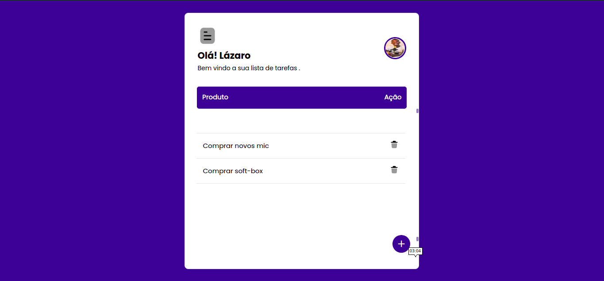

Todo-App 💡

Este é um projeto desenvolvido no mini-curso de javascript.

Onde básicamente o foco do conteúdo foi ensianar javascript básico de forma prática, razão pela qual escolhe este projeto como base de ensino.

## Funcionalidades 💻 

- Adicionar produto
- Listar produto
- Deletar produto

## Aprendizados 📖

- Neste mini-curso você vai aprender conceitos básicos de javascript.
- Você aprenderá como manipular dom com javascript e muito mais.

## Screenshots 📷

 <h1 align = center>
    
</h1>

## Stack utilizada 🏷️

**Front-end:** html, css, javascript

## Link do curso

- https://www.youtube.com/watch?v=zJhoG091FSE&list=PLoURJn_OIlkyvti5EVp1fJVM2fAgbSZlb